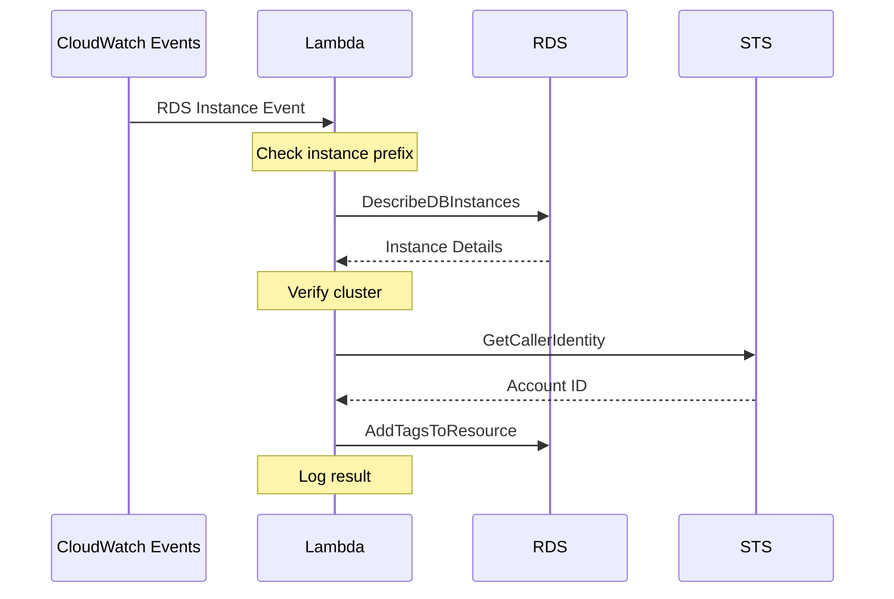

# 🏷️ RDS Cluster Read Replica Tag Setter

A Lambda function that automatically applies tags to Aurora read replicas when they are created by application autoscaling.

## Overview

When Aurora scales by creating new read replicas, these instances need proper tagging for resource management. This Lambda function automatically detects new autoscaling-created read replicas and applies predefined tags to them if they belong to the specified Aurora cluster.

## Flow



## How It Works

1. Triggered by CloudWatch Event when RDS creates a new instance
2. Validates if instance name contains "application-autoscaling-" prefix
3. Gets instance details and verifies cluster membership
4. Retrieves AWS account ID for ARN construction
5. Applies configured tags if instance belongs to target cluster

## Configuration

### Environment Variables

Required:
- `RDS_CLUSTER_IDENTIFIER`: Target Aurora cluster identifier
- `TAGS`: JSON string of tags to apply, for example:

    {
        "Environment": "production",
        "Type": "read-replica",
        "ManagedBy": "terraform"
    }

### Required IAM Permissions

The Lambda function requires the following IAM permissions:

```json
{
    "Version": "2012-10-17",
    "Statement": [
        {
            "Effect": "Allow",
            "Action": [
                "rds:DescribeDBInstances",
                "rds:AddTagsToResource"
            ],
            "Resource": [
                "arn:aws:rds:*:*:db:application-autoscaling-*"
            ]
        },
        {
            "Effect": "Allow",
            "Action": "sts:GetCallerIdentity",
            "Resource": "*"
        }
    ]
}
```

Additionally, the function needs standard Lambda execution permissions:

```json
{
    "Effect": "Allow",
    "Action": [
        "logs:CreateLogGroup",
        "logs:CreateLogStream",
        "logs:PutLogEvents"
    ],
    "Resource": [
        "arn:aws:logs:*:*:log-group:/aws/lambda/*"
    ]
}
```

## Development

### Prerequisites
- Go 1.21+
- AWS credentials with appropriate permissions
- Make

### Project Structure

    .
    ├── cmd/
    │   └── main.go                 # Lambda entrypoint
    ├── internal/
    │   └── metrics/
    │       ├── aws.go             # AWS service interfaces
    │       ├── handler.go         # Core business logic
    │       └── handler_test.go    # Tests
    ├── Makefile                   # Build automation
    └── .golangci.yml              # Linter config

### Common Commands

    make all          # Full build cycle (clean, vendor, build, package for Lambda)
    make build        # Build Lambda binary (Linux amd64)
    make build-linux  # Build for Linux AMD64 local development
    make build-mac    # Build for local development on M-series Macs
    make test         # Run tests
    make lint         # Run linter
    make clean        # Clean build artifacts

### Local Development

For Linux AMD64:

    make build-linux  # Creates ./bootstrap binary
    ./bootstrap --version

For local testing on M-series Macs:

    make build-mac    # Creates ./bootstrap binary
    ./bootstrap --version

For Lambda deployment:

    make all         # Creates main.zip ready for Lambda

## Testing

The project includes unit tests with mocked AWS services. Run tests with:

    make test

### Test Coverage

    make coverage     # Generate coverage report

### Version Information

The binary includes version information that can be accessed with:

    ./rds-tag-setter --version

This shows:
- Version tag/commit
- Git commit hash
- Build timestamp

## Error Handling

The function handles several error cases:
- Non-autoscaling instances (skipped)
- Instances from different clusters (skipped)
- AWS API errors (logged and reported)
- Invalid environment variables (validated at startup)

## Logging

Uses structured JSON logging with fields:
- aws_request_id
- function_name
- function_version

## Infrastructure

This Lambda is part of the RDS infrastructure managed via Terraform. See:
- `../main.tf` - Lambda configuration
- `../variables.tf` - Configuration variables
- `../prod-aurora.tf` - Related Aurora cluster config
